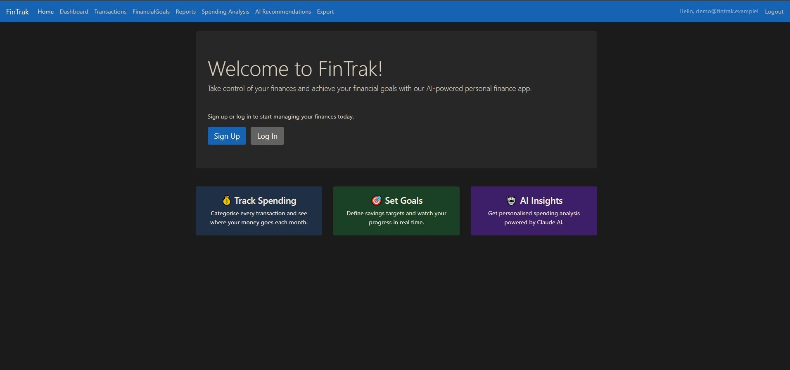
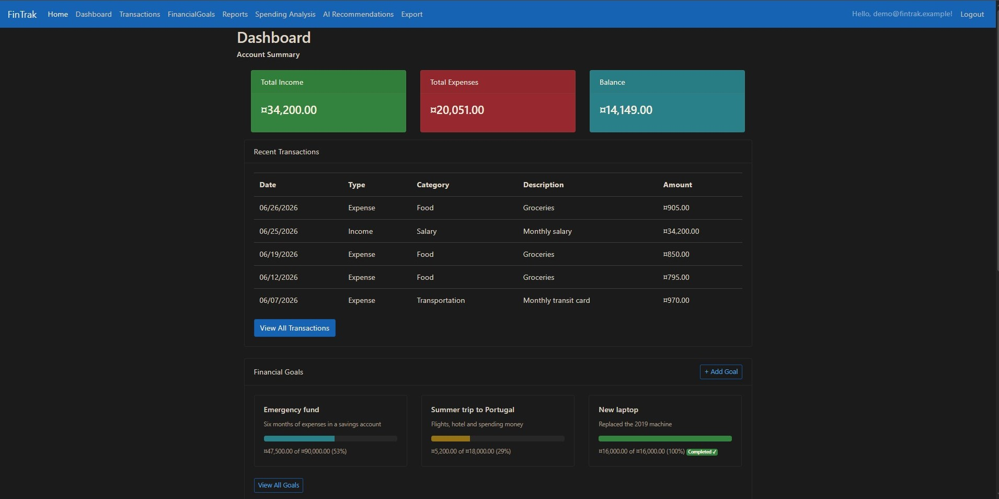
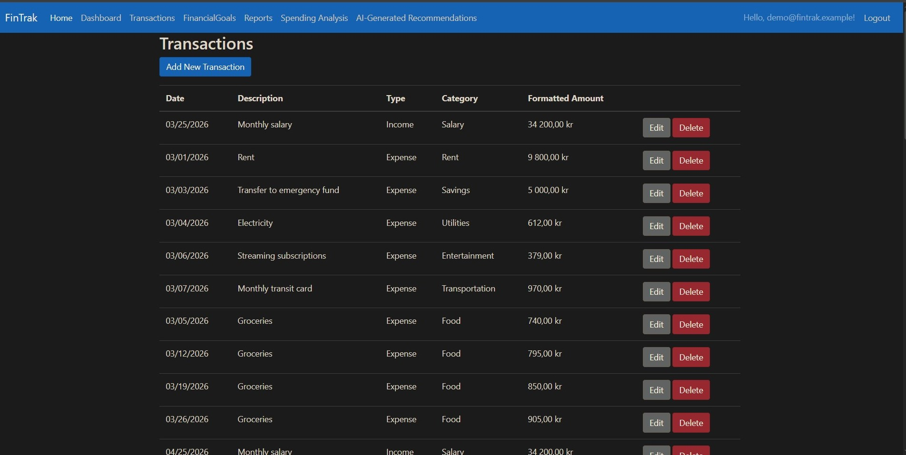
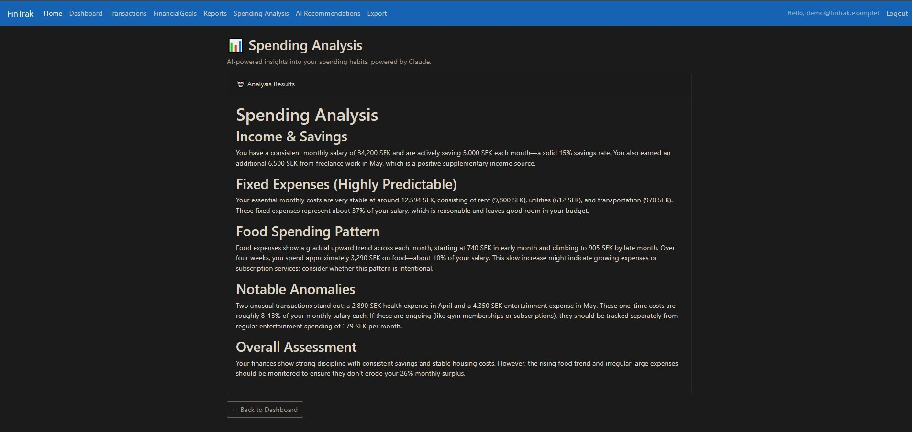
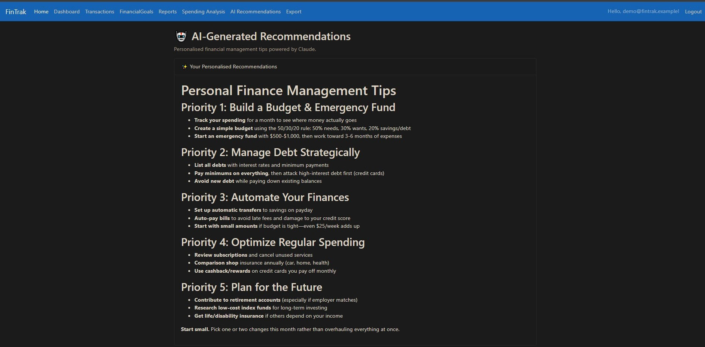
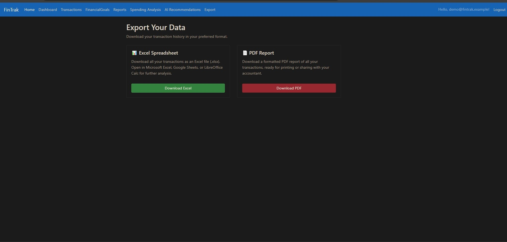

# FinTrak: From Vulnerable .NET 5 App to AI-Powered Finance Manager on Kubernetes

[](https://github.com/okalangkenneth/FinanceApp/actions/workflows/ci.yml)
[](https://dotnet.microsoft.com/en-us/download/dotnet/8.0)
[](LICENSE)

I inherited a three-year-old .NET 5 finance application with an anonymous data-export endpoint that served every user's transaction history to any unauthenticated visitor. There was also a dead OpenAI integration that hadn't worked since the API changed, a DinkToPdf dependency that crashed at runtime because the required binaries were never included, and two IDOR vulnerabilities that let any logged-in user delete or modify other users' records. I patched the security issues first, then upgraded the stack to .NET 8, replaced the broken OpenAI calls with the Anthropic Claude API, containerised the whole thing with Docker and Kubernetes, and rewired the CI pipeline. The Economics background isn't accidental: personal finance is a domain I understand from first principles, and the spending analysis feature reflects that.

## Demo

[](https://youtu.be/MA0fJQzMLPc)

*Click to watch the full demo on YouTube*













## What was fixed

The rehabilitation took the app through seven phases. The security fixes came before any upgrade work -- shipping a .NET 8 version of an app that leaks all users' data is not an improvement.

| Before | After |
|--------|-------|
| Anonymous export: all users' transactions to any visitor | `[Authorize]` + per-user filtering on every query |
| IDOR on edit/delete: any user could modify any record | Ownership checks on all write paths |
| .NET 5 (EOL May 2022) | .NET 8 LTS |
| Dead OpenAI completions API (endpoint removed by OpenAI) | Anthropic Claude API (`claude-haiku-4-5`) |
| SQL Server dev / PostgreSQL prod split (migrations broken) | PostgreSQL everywhere |
| DinkToPdf (archived, wkhtmltox binaries missing, crashes at runtime) | QuestPDF (Community licence) |
| EPPlus 5.7.5 (Polyform Noncommercial licence) | ClosedXML (MIT) |
| Heroku deploy (free tier removed November 2022) | Docker + Kubernetes + GitHub Actions CI |
| `ApplicationUser.EmailConfirmed` shadowing `IdentityUser.EmailConfirmed` | Duplicate property removed |
| Reports classifying by Category instead of TransactionType | Fixed: dashboard and reports now agree |
| Missing `[ValidateAntiForgeryToken]` on goal update | Added |
| User enumeration on login ("User not found.") | Generic error message + lockout enabled |
| Logout over GET (CSRF) | POST logout |

## Features

- **Dashboard** -- income / expense / net summary, monthly spending chart, goal progress cards
- **Transaction management** -- record and categorise income and expenses across standard categories
- **Financial goals** -- set savings targets, track progress with a visual bar
- **AI spending analysis** -- Anthropic Claude analyses your spending patterns and surfaces recommendations
- **PDF export** -- download a formatted transaction report via QuestPDF
- **Excel export** -- download transactions as an `.xlsx` file via ClosedXML
- **Email confirmation** -- registration flow uses SendGrid; app runs without it if no key is configured
- **Multi-currency** -- SEK default with support for additional currencies
- **Reports** -- income vs expense breakdown by category

## Tech stack

**.NET 8** | **ASP.NET Core MVC** | **EF Core 8** | **PostgreSQL 16** | **ASP.NET Core Identity 8**

**Anthropic Claude API** | **Markdig** | **QuestPDF** | **ClosedXML** | **Serilog** | **SendGrid**

**Docker** | **docker-compose** | **Kubernetes** (manifests in `k8s/`) | **GitHub Actions CI**

## Run locally

Requires Docker.

```bash
cp .env.example .env    # optionally add your Anthropic API key; the app runs without it
docker compose up
```

The app starts at **http://localhost:8888** with PostgreSQL alongside it. The database schema is migrated automatically on first start.

To seed a demo user with sample transactions and goals:

```bash
# Add to your .env:
SEED_DEMO_DATA=true
SEED_DEMO_PASSWORD=YourChosenPassword1!
```

Then log in as `demo@fintrak.example` with the password you set.

## Security notes

Three critical findings from the initial audit and what was done about them:

**Anonymous data export.** `ExportController` had no `[Authorize]` attribute and no per-user filter, meaning any unauthenticated HTTP request to `/Export` returned a CSV of every transaction in the database. Fixed by adding `[Authorize]` and filtering all queries to the authenticated user's ID.

**IDOR on transactions and goals.** The edit and delete endpoints in `TransactionsController` and `FinancialGoalsController` accepted a record ID without checking ownership. A logged-in user could modify or delete any other user's data by guessing an integer ID. Fixed by verifying `UserId == currentUserId` before every write operation.

**Privilege escalation via edit POST.** The transaction edit POST reassigned `UserId` from the form body, meaning a malicious request could silently transfer a record to a different user. Fixed by ignoring the posted `UserId` and always writing the authenticated user's ID.

Security came first. The .NET version upgrade and feature work followed once the data was safe.

## Licence

MIT
